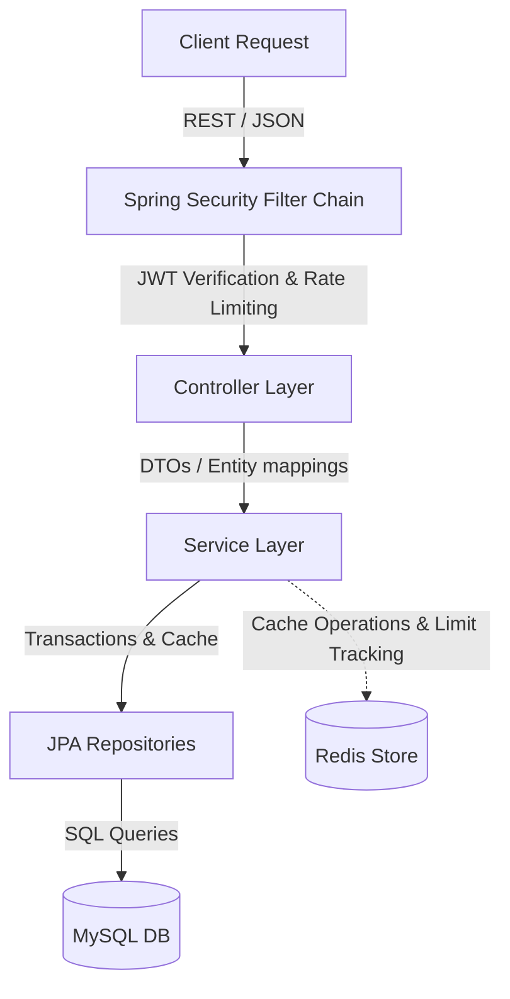

# Bank Management API (Banking-Backend)

A modern, high-performance, and secure banking backend system built using **Spring Boot 4.0.6**, **Java 25**, **MySQL**, and **Redis**. This project exposes a complete suite of RESTful endpoints to manage bank accounts, secure endpoints using JWT authentication, log transactional events, perform high-speed caching, and enforce dynamic rate limiting.

---

## 🚀 Key Features

*   **Secure Authentication (JWT & Redis Session Management):**
    *   Authentication via JWT using JSON Web Tokens (JJWT 0.12.6).
    *   Stateful logout functionality enabled by registering active sessions and blacklisting tokens in Redis with sliding TTL.
    *   Single active session enforcement (logging in from a new client terminates the user's previous active JWT token session).
*   **Comprehensive Bank Account Operations:**
    *   Creation of accounts (automatically synchronized during user registration) with automated sequential account number generation (`ACC0001`, `ACC0002`, etc.).
    *   Support for deposits, withdrawals, profile updates, and direct account deletion.
    *   Transactional money transfers between accounts ensuring ACID compliance via Spring's `@Transactional`.
*   **Transaction Logging & Audit Trail:**
    *   Tracks all activities including deposits, withdrawals, and bank transfers.
    *   Stores timestamps, transaction types, amounts, and post-transaction balances.
    *   Queryable statements with optional date filters (`yyyy-MM-dd`).
*   **High-Speed Caching (Redis Cache):**
    *   Integrated with Spring Cache abstraction.
    *   Drastically reduces database read load by caching active account details (`@Cacheable`, `@CachePut`, `@CacheEvict`).
*   **Dynamic API Rate Limiting:**
    *   Protects critical endpoints (e.g., transfers, deposits, withdrawals) from abuse.
    *   Uses a custom Redis-backed interceptor linked to a custom `@RateLimit` annotation.
*   **Enhanced Swagger UI Developer Experience:**
    *   Auto-generated OpenAPI v3 documentation.
    *   **Auto-Authorization:** Swagger UI includes a custom JS transformer that intercepts successful login calls (`/api/v1/auth/login`) and automatically applies the JWT bearer token to Swagger's security context, removing the need to manually copy-paste token values.
*   **Observability & Diagnostics:**
    *   Exposes Spring Boot Actuator endpoints (`/actuator/**`) for service health, JVM metrics, and application info.
    *   Uses Micrometer `MeterRegistry` to count banking operation frequencies and track volume metrics.

---

## 🛠️ Technology Stack

| Technology | Purpose | Version |
| :--- | :--- | :--- |
| **Java** | Programming Language | 25 |
| **Spring Boot** | Application Framework | 4.0.6 |
| **Spring Security** | Authentication & Authorization | Built-in (Spring Boot 4.x) |
| **Spring Data JPA** | Database Object-Relational Mapping | Built-in (Spring Boot 4.x) |
| **MySQL Connector** | Relational Database Driver | 8.x (Connector-J) |
| **Spring Data Redis** | Caching, Rate Limiting, and Sessions | Built-in (Spring Boot 4.x) |
| **JJWT (io.jsonwebtoken)** | JWT Token Management | 0.12.6 |
| **Springdoc OpenAPI** | REST Documentation & UI | 2.8.5 |
| **Lombok** | Boilerplate Reducer (Getters/Setters) | Provided |

---

## 📂 Project Architecture

The codebase follows a clean, decoupled MVC / Layered architecture:



*   **`config/`**: Contains configurations for Security, JWT Filters, Redis connection, MVC Interceptors (Rate Limiting), and OpenAPI Customizers.
*   **`controller/`**: Exposes REST endpoints, registers URL mapping patterns, and configures API operations tags.
*   **`service/`**: Implements banking logic and coordinates transaction bounds.
*   **`model/`**: Defines JPA Database Entities (`User`, `BankAccount`, `Transaction`).
*   **`dto/`**: Standardizes Request/Response payloads (e.g. `LoginRequest`, `ApiResponse`).
*   **`repository/`**: Interfaces extending `JpaRepository` for data access.
*   **`validation/`**: Custom input validators and Rate Limit annotations.

---

## ⚙️ Getting Started

### 📋 Prerequisites

Before running the application, make sure you have the following installed:
*   [JDK 25](https://jdk.java.net/25/)
*   [Maven 3.9+](https://maven.apache.org/)
*   [MySQL Server](https://dev.mysql.com/downloads/installer/) (Running on port `3306`)
*   [Redis Server](https://redis.io/downloads/) (Running on port `6379`)

### 🔧 Configuration

Update the configurations in [application.properties](file:///d:/project/Project/src/main/resources/application.properties) according to your local environment:

```properties
# Server Port
server.port=8080

# MySQL Database Configurations
spring.datasource.url=jdbc:mysql://localhost:3306/bank
spring.datasource.username=YOUR_MYSQL_USERNAME
spring.datasource.password=YOUR_MYSQL_PASSWORD
spring.datasource.driver-class-name=com.mysql.cj.jdbc.Driver

# JPA Configuration
spring.jpa.hibernate.ddl-auto=update
spring.jpa.show-sql=true

# Redis Configuration
spring.data.redis.host=localhost
spring.data.redis.port=6379
spring.cache.type=redis

# Security & JWT Token TTL (dynamic)
jwt.validity-duration=10m

# Rate Limiter defaults (requests per period in seconds)
ratelimit.default.limit=5
ratelimit.default.period=60
```

> [!NOTE]  
> Make sure to create the database schema `bank` in MySQL before starting the application:
> ```sql
> CREATE DATABASE bank;
> ```

---

## 🏃 Running the Application

### Running with Maven Wrapper
You can run the application directly from the root folder:

**On Windows (Command Prompt/PowerShell):**
```cmd
mvnw.cmd spring-boot:run
```

**On Linux/macOS:**
```bash
chmod +x mvnw
./mvnw spring-boot:run
```

The application will start on **`http://localhost:8080`**.

### Running Automated Tests
Run the Maven test suite using:
```bash
./mvnw test
```

---

## 📖 API Documentation & Testing

Once the application is running, you can access the interactive Swagger API console at:
*   **Swagger UI:** [http://localhost:8080/swagger-ui.html](http://localhost:8080/swagger-ui.html)
*   **OpenAPI Specs (JSON):** [http://localhost:8080/api-docs](http://localhost:8080/api-docs)

### 💡 Dynamic Swagger Authorization
The project features a custom JavaScript injection inside Swagger UI. When you send a login request to `/api/v1/auth/login` from the Swagger interface, the UI intercepts the successful response, reads the JWT token, and automatically applies it as the `Authorization: Bearer <token>` header for all future requests. You do not need to manually click **Authorize** or paste token prefixes.

---

## 🛡️ Endpoint Catalog

All API endpoints are prefixed with `/api/v1`.

### 🔑 Authentication (`/api/v1/auth`)

| Endpoint | Method | Auth Required | Description |
| :--- | :--- | :---: | :--- |
| `/register` | `POST` | No | Registers a new user. Expects `username`, `password`, `firstName`, `lastName`, and `role`. |
| `/login` | `POST` | No | Authenticates user credentials and returns a JWT token. |
| `/logout` | `POST` | Yes | Invalidates the current JWT session in Redis. |

### 🏦 Bank Account Operations (`/api/v1/bank`)

| Endpoint | Method | Auth Required | Rate Limited | Description |
| :--- | :--- | :---: | :---: | :--- |
| `/` | `POST` | Yes | Yes | Creates a new bank account with custom details. |
| `/` | `GET` | Yes | No | Retrieves all active bank accounts. |
| `/{accountNumber}` | `GET` | Yes | Yes | Retrieves details of a specific bank account. |
| `/deposit/{accountNumber}/{amount}` | `PUT` | Yes | Yes | Deposits money into the specified bank account. |
| `/withdraw/{accountNumber}/{amount}` | `PUT` | Yes | Yes | Withdraws money from the bank account. |
| `/transfer/{sourceAcc}/{destAcc}/{amount}` | `PUT` | Yes | Yes | Transfers money from a source account to a destination account. |
| `/` | `PATCH` | Yes | No | Updates metadata (first/last name) of an account. |
| `/{accountNumber}` | `DELETE` | Yes | No | Deletes a bank account and cleans associated data. |

### 📈 Transactions History (`/api/v1/bank`)

| Endpoint | Method | Auth Required | Rate Limited | Description |
| :--- | :--- | :---: | :---: | :--- |
| `/{accountNumber}/transactions` | `GET` | Yes | No | Retrieves transaction list for an account. Query parameter `date` (format `yyyy-MM-dd`) is optional. |

---

## 📈 Monitoring & Actuator

Spring Boot Actuator endpoints are exposed for system metrics. Access them at:
*   Health Status: [http://localhost:8080/actuator/health](http://localhost:8080/actuator/health)
*   All Actuator Endpoints: [http://localhost:8080/actuator](http://localhost:8080/actuator)
